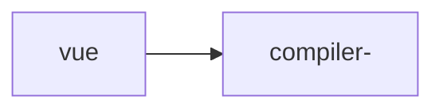

[b站教程](https://www.bilibili.com/video/BV1bS4y1T7ng?p=4&spm_id_from=pageDriver)

Vue3源码下载  

1. 首先下载vue源码

   https://github.com/vuejs/core

2. 全局安装pnpm

   ```shell
   npm i -g pnpm
   ```

   

3. 安装依赖

   ```shell
   pnpm install
   ```

4. 在package.json文件中修改scripts的dev命令，加上--sourcemap 参数

5. 然后启动整个项目，执行`npm run dev`，出现如下界面，表示已经启动成功。

   

6. 用浏览器打开下面文件

   packages/vue/examples/composition/todomvc.html

   在createApp方法这里打个断点，一步一步往下看

7. 整个项目结构 采用的是pnpm monorepo

最重要的包是vue



学习主线：

**实例创建过程  createApp**

**挂载过程  app.mount()**

学习方法： 

单步调试 从createApp->ensureRenderer 得到一个渲染器 renderer.createApp -> renderer.ts文件中的


渲染器返回了一个对象，包含三个属性

createAppAPI

渲染器作用：首次渲染，获取应用实例

核心挂载函数如下：


```javascript
// app.mount('#app')
mount(
        rootContainer: HostElement,// 宿主元素
        isHydrate?: boolean,
        isSVG?: boolean
      ): any {
        if (!isMounted) {
          // 创建根组件的虚拟dom
          const vnode = createVNode(
            rootComponent as ConcreteComponent,
            rootProps
          )
          // store app context on the root VNode.
          // this will be set on the root instance on initial mount.
          vnode.appContext = context

          // HMR root reload
          if (__DEV__) {
            context.reload = () => {
              render(cloneVNode(vnode), rootContainer, isSVG)
            }
          }

          if (isHydrate && hydrate) {
            hydrate(vnode as VNode<Node, Element>, rootContainer as any)
          } else {
            // 重要的地方 调用了render
            render(vnode, rootContainer, isSVG)
          }
          isMounted = true
          app._container = rootContainer
          // for devtools and telemetry
          ;(rootContainer as any).__vue_app__ = app

          if (__DEV__ || __FEATURE_PROD_DEVTOOLS__) {
            app._instance = vnode.component
            devtoolsInitApp(app, version)
          }

          return getExposeProxy(vnode.component!) || vnode.component!.proxy
        } else if (__DEV__) {
          warn(
            `App has already been mounted.\n` +
              `If you want to remount the same app, move your app creation logic ` +
              `into a factory function and create fresh app instances for each ` +
              `mount - e.g. \`const createMyApp = () => createApp(App)\``
          )
        }
      },
```

挂载只执行一次

初始化

建立更新机制

 


什么是数据响应式？

一种机制 能够侦测到变化，响应式这个变化到视图


virtualDom

渲染函数  render

vue3中的h函数是从vue中直接导入的

```javascript
import { h } from 'vue';

render() {
  return h('div', {
    id: 'foo',
    onLIck: this,onClick
  }, 'hello')
}
```


```javascript
import { h } from 'vue'

const app = {
  render() {
    return this.ok ?
      h('div', { id: 'hello'}, [h('span', 'world')])
    : h('p', 'other branch')
  }
}
```

